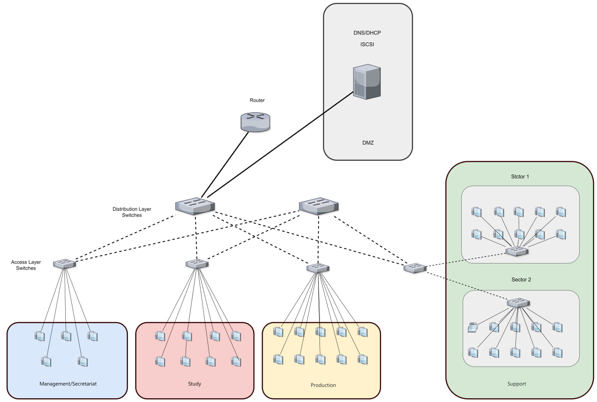
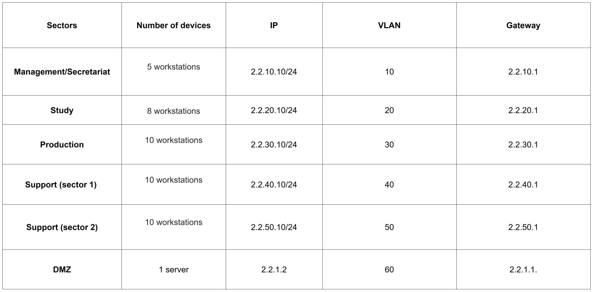

### Kamkar_Secure_Network_Design
This project involves designing a secure and scalable network for a client moving to a new office. The network is built using Cisco Packet Tracer and adheres to best practices for network security, segmentation, and manageability.
### 1. **General Information**
- **Network Description**: The network is designed to support the operations of all company departments and provides access to corporate resources, as well as secure connectivity to external resources via the Internet.
- **Key Functions**:
    - Ensuring data transmission between departments (Management, Study, Production, Support).
    - Organizing access to servers and services (e.g., DNS, DHCP, iSCSI).
    - Ensuring network security through the use of VLANs, ACLs, and network segmentation (DMZ).
    - Managing and monitoring the network to maintain its uninterrupted operation.
- **Documentation Date**: October 24, 2024
- **Responsible Persons**: Mattieu Gedeon, Gabriel Aloho, Kseniia Tanekem.

### 2. **Network Topology**

- **Network Structure Description**:
    - The network is built on a star topology using Cisco switches and routers.
    - The network core is the switch SW0, which is connected to the ISR4331 router for inter-VLAN routing and Internet access.
    - The network integrates several VLANs, providing segmentation by department (Management, Study, Production, Support, DMZ).
    - Servers are located in the DMZ for enhanced security.
- **Connection Type**: Internal departments are connected through wired Ethernet connections. Core devices are connected via GigabitEthernet trunk ports.

### 3. **Network Coverage Area**

- **Physical Location**: The network covers several company departments, each operating in a separate VLAN.
    - **VLAN 10**: Management Department.
    - **VLAN 20**: Study Department.
    - **VLAN 30**: Production Department.
    - **VLAN 40 and VLAN 50**: Support Department.
    - **VLAN 60**: Demilitarized Zone (DMZ) for servers.

### 4. **Network Tasks and Goals**

- **Main Network Tasks**:
    - Maintaining high performance and stability of the network infrastructure.
    - Ensuring secure access to corporate and external resources.
    - Preventing unauthorized access through network segmentation (VLANs and DMZ).
    - Ensuring backup of critical data and equipment configurations.
- **Strategic Goals**:
    - Network scalability for future expansion (adding new departments or users).
    - Continuous improvement of security through hardware updates and the introduction of new technologies (e.g., implementing VPN for remote access).
    - Ensuring high availability through the use of fault-tolerant equipment and backup links.

### 5. **Description of Equipment Used**

- **Cisco ISR4331 Router**: 
    - 1 Router: Router 1
- **Cisco 2960-24TT Switches**:
    - 6 switches: SW1, SW2, SW3, SW4, SW4.1, SW4.2
- **Cisco 3650-24PS Switches**:
    - 2 switches: SW0, SW1.1.
- **Servers**:
     1 server: DNS/DHCP server, Application server, file server
- **Workstations**:
    - 43 PC

### 6. **Network Diagram**

### 7.**VLAN Table and IP Network Configuration**

### 8. **Central Components**

- **ISR4331 Router**:
    
    - Provides routing between VLANs and access to external networks (Internet or other networks).
        
    - **Interfaces**:
        
        - **Gig0/0/0**: Connected to the central switch **SW0** for inter-segment routing.
    - **Functions**:
        
        - Inter-segment routing, firewalls, and access control (ACL) between internal VLANs.
          
- **SW0 Switch (Cisco 2960)**:
    
    - Central backbone switch, connected to the ISR4331 router and all other switches.
        
    - **Main Interfaces**:
        
        - Connection to ISR4331 router via **Gig1/0/5**.
        - Connection to other VLAN switches via trunk interfaces.
    - **Functions**: Manages all inter-switch communication, serving as the central node for traffic between network segments.
        

**Switches and VLANs**

The network uses multiple managed Cisco 2960 switches, each serving a specific VLAN. VLANs divide the network into logical segments, providing both security and efficient traffic management.

- **SW1 (Cisco 2960) – VLAN 10 (Management)**:
    
    - **Connections**:
        - Linked to **SW0** via trunk interface **Gig0/2**.
        - Connected to five management department workstations.
    - **VLAN 10**: Serves the administration and management department. This segment is isolated from other VLANs for security.
- **SW2 (Cisco 2960) – VLAN 20 (Study)**:
    
    - **Connections**:
        - Linked to **SW0** via trunk interface.
        - Connected to eight study department workstations.
    - **VLAN 20**: Used for educational or training purposes within the company, including training computers for staff.
- **SW3 (Cisco 2960) – VLAN 30 (Production)**:
    
    - **Connections**:
        - Linked to **SW0** via trunk interface.
        - Connected to ten production department workstations.
    - **VLAN 30**: Serves the production department of the company, used for sharing critical data and applications among employees.
- **SW4 (Cisco 2960) – VLAN 40 and VLAN 50 (Support)**:
    
    - **Connections**:
        - Linked to **SW0** via trunk interface.
        - Connected to switches **SW4.1** and **SW4.2** for VLAN 40 and VLAN 50 respectively.
        - **SW4.1** (VLAN 40) and **SW4.2** (VLAN 50): Connected to 20 workstations distributed across two support segments.
    - **VLAN 40 and VLAN 50**: Serve the support department, including technical staff and the company's service department. Each segment is isolated to enhance security and traffic management.

### 9. **Demilitarized Zone (DMZ)**

- **VLAN 60 (DMZ)**: Used for hosting critical servers accessible to both the internal network and external users (if there is Internet access).
- **Servers**:
    - **DNS/DHCP Server** (IP: 2.2.1.2, Gateway: 2.2.1.1): Provides internal DNS and DHCP services for all VLANs.
    - **Application and Web Servers**: If the company uses web services or applications, they may be located here.
- **Connection to ISR4331 Router**: Protected by firewalls and access control lists (ACL), limiting access to the DMZ.

### 10. **Devices and Workstations**

- **Workstations (PC-PT)**: Connected in each department and distributed across VLANs.
    - **VLAN 10** (PC0–PC4): Management department, operating in the Management VLAN.
    - **VLAN 20** (PC5–PC12): Study department (Study), where staff training takes place.
    - **VLAN 30** (PC13–PC22): Production department, where the main company projects are handled.
    - **VLAN 40 and 50** (PC23–PC42): Support department, serving all other company divisions.

### 11. **Description of Trunk Connections**

- **Trunk Ports** (Gigabit Ethernet):
    - All key network devices are connected via GigabitEthernet trunk ports to ensure maximum data transfer speed between segments.
    - These ports operate in trunk mode, allowing traffic from all VLANs to be transmitted over a single physical line.

### 12. **Security and Access Management**

- **Traffic Isolation Between Departments**: Each VLAN represents a separate subnet, providing logical isolation between different user groups. VLANs exist for different departments and functions: Management (VLAN 10), Study (VLAN 20), Production (VLAN 30), Support (VLAN 40), and DMZ (VLAN 60).
    
- **Segmentation Minimizes Attack Impact**: If an attacker compromises a device in one VLAN, they cannot directly attack devices in other VLANs without routing through a controlled router.
    
- **Controlled Access**: The DMZ is separated from the main network, and access to it is strictly regulated by the router and firewalls. This reduces the risk of attacks on the internal network, as even if a server in the DMZ is compromised, the attacker will not gain direct access to internal resources. ACLs (Access Control Lists) on the router are used to manage security and restrict access between VLANs, further isolating network segments and controlling access to servers in the DMZ.
    
- **Flexible Traffic Management**: VLAN segmentation allows system administrators to easily manage access and traffic between departments without changing the physical network topology.
    
- **Simplified Scalability**: If the network needs to be expanded or a new department added, a new VLAN can be created, simplifying the management of a large and distributed infrastructure.

### 13. **Cost of network deployment**

| **Equipment**              | **Quantity** | **Unit Price (EUR)** | **Total Cost (EUR)** |
| -------------------------- | ------------ | -------------------- | -------------------- |
| **Cisco ISR4331 Router**   | 1            | 3000                 | 3000                 |
| **Cisco 2960-24PS Switch** | 2            | 1,000                | 2000                 |
| **Cisco 2960-24TT Switch** | 6            | 1000                 | 6000                 |
| **Server**                 | 1            | 3,000                | 3000                 |
| **Personal Computers**     | 43           | 700                  | 30,100               |
| **Cables**                 | ~58          | Varies (~10-20 EUR)  | 730                  |
| **Total**                  |              |                      | **44,830**           |

